# Flow diagrams — CreateTablesService

This document describes the flow of **CreateTablesService::apply()** and the checks/API used in each scenario. The service uses the **introspected** schema (pass `$this->connection->createSchemaManager()->introspectSchema()`) for all checks.

**Implementation note:** The actual code follows **Phases 1–4** as in [DECLARATIVE_SCHEMA.md](DECLARATIVE_SCHEMA.md#order-of-operations-apply-execution-order): Phase 1 (drop FKs, drop indexes), Phase 2 (drop columns, drop PK, drop tables), Phase 3 (create table, rename columns, modify columns, add columns), Phase 4 (create indexes/unique, create FKs). The diagrams below are conceptual; method names may differ from the source (e.g. no `doApply`/`applyTableEdits` in code).

---

## 1. General flow: apply() → doApply()

**What this diagram shows:** The entry point is `apply(schema, definition)`, which collects SQL into an array and may forward each statement to an emitter. The main work is done in a conceptual `doApply`: obtain the platform, process `drop_tables`, then for each table in the definition either drop it, create it (if missing), or apply edits (rename/modify/add columns, indexes, FKs). The flowchart is conceptual; the real implementation uses Phases 1–4 (see [DECLARATIVE_SCHEMA.md](DECLARATIVE_SCHEMA.md#order-of-operations-apply-execution-order)).

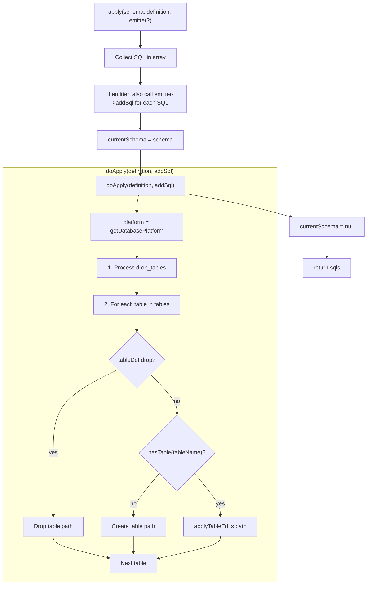

**APIs used in this block:** `Connection::getDatabasePlatform()`, `Schema::hasTable()` (via `hasTable()`).

**Note:** Dropping a table is done only via the top-level **drop_tables** list (step 1), not via a table definition. The "tableDef drop?" branch in the diagram is conceptual; the implementation does not support `drop => true` in a table def.

---

## 2. Drop table (drop_tables or tables[name][drop])

**What this diagram shows:** When a table is listed in `drop_tables`, the service checks if it exists in the schema. If not, the step is skipped. If it exists, the table is resolved from the schema, the platform generates DROP TABLE SQL, and each statement is added to the output. No ALTER TABLE is used; tables are dropped only when they exist. (Dropping is done only via the top-level **drop_tables** list; the bundle does not support `drop => true` inside a table definition.)

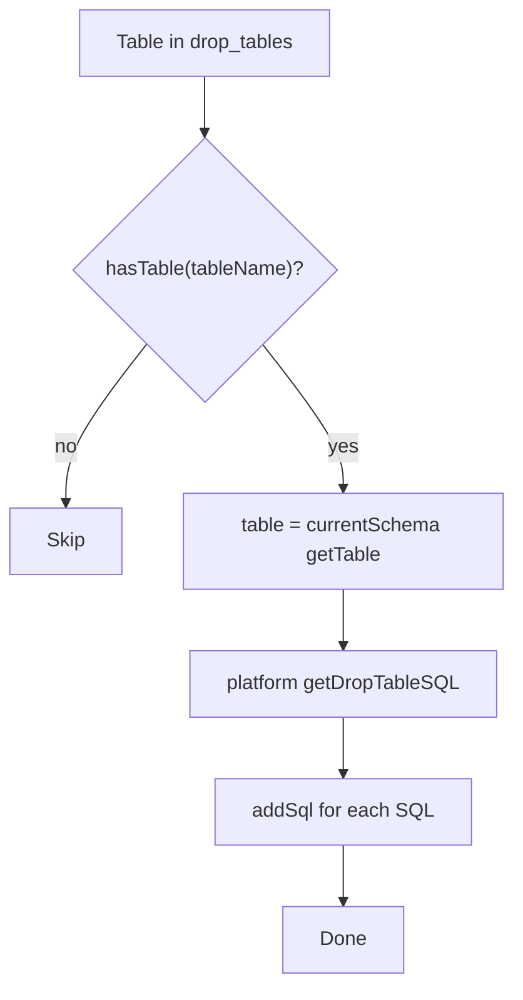

**Checks:** `Schema::hasTable(tableName)`  
**API:** `Schema::getTable()`, `AbstractPlatform::getDropTableSQL(Table)`.

---

## 3. Create new table (table does not exist)

**What this diagram shows:** When the table is not present in the introspected schema, the service checks whether the definition has only column entries with RENAME (no full column types); if so, it skips. Otherwise it builds a DBAL `Table` from the definition (columns and primary key only; indexes and FKs are created later in Phase 4). The platform’s `getCreateTableSQL` produces one or more statements (e.g. CREATE TABLE), which are added to the result. This path is used only for new tables.

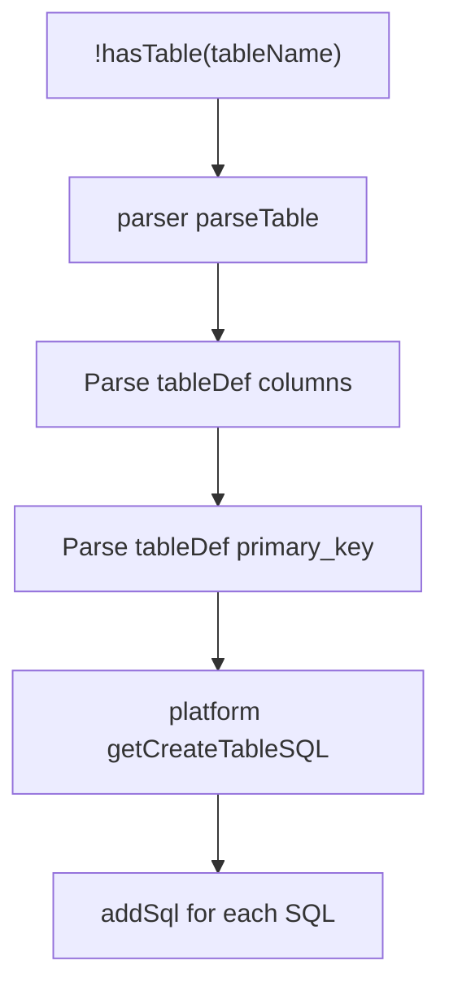

**Checks:** `Schema::hasTable(tableName)` (false → create path).  
**API:** `SchemaDefinitionParser::parseTable()` (builds a DBAL `Table` from COLUMNS and PRIMARY_KEY only; indexes and FKs are applied in Phase 4), `AbstractPlatform::getCreateTableSQL(Table)`.

---

## 4. Edit table: applyTableEdits overview

**What this diagram shows:** When the table already exists, all changes are applied in a fixed order (left to right): first drop shortcuts (FKs, indexes, columns), then process columns (rename, drop, add, modify), then drop primary key if requested, then add primary key if defined, then add indexes, and finally add foreign keys. This order keeps dependencies valid (e.g. columns exist before indexes that reference them). The diagram is conceptual; the actual code uses Phase 1–4 with the same logical order.

When the table **exists**, all changes go through `applyTableEdits` in this order:

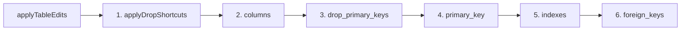

---

## 5. Drop shortcuts (drop_foreign_keys, drop_indexes, drop_columns)

**What this diagram shows:** For each table, the service processes drop shortcuts in dependency order: first every name in `drop_foreign_keys` (only if the FK exists), then every name in `drop_indexes` (only if the index exists), then every name in `drop_columns` (only if the column exists). Each “emit” produces ALTER TABLE SQL via the comparator. Skipping when the item does not exist keeps the step idempotent.

Order is **FK → index → column**; after each drop the internal table state is updated so the next diff is correct.

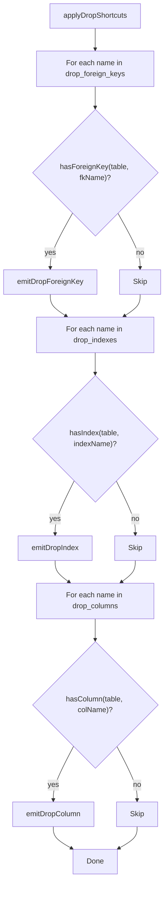

**Checks:** `Schema::getTable()->hasForeignKey()`, `hasIndex()`, `hasColumn()` (wrapped by the service). **Order:** FK → index → column; state updated after each drop.

---

## 6. Columns: rename, drop, add, modify

**What this diagram shows:** For each column entry in the definition, the flow branches on the operation: (1) If `drop` is set and the column exists, emit DROP COLUMN. (2) Else if `rename` is set and the old column exists (and the new name does not), emit RENAME COLUMN. (3) Else if the column has a type and already exists, emit MODIFY COLUMN; if it does not exist, emit ADD COLUMN. This ensures only one kind of change per column and only when the current state matches (e.g. no add if the column is already there).

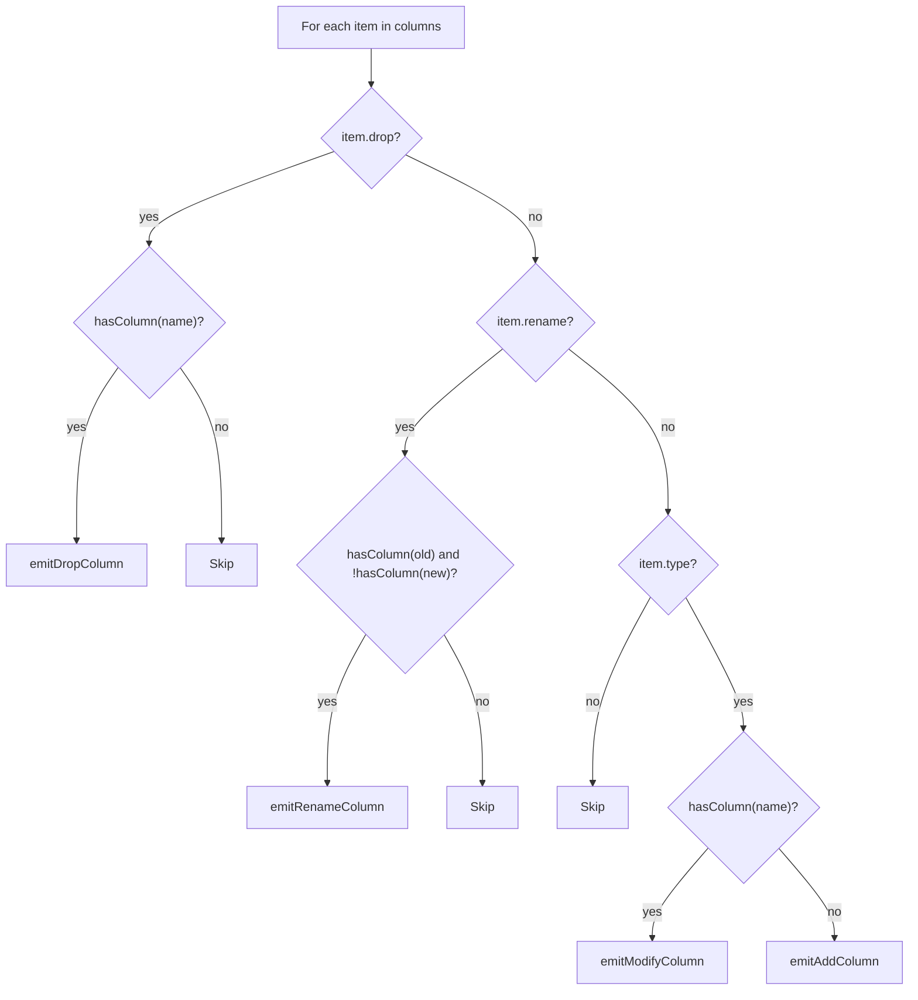

**Checks:** `Schema::getTable()->hasColumn()` for each column name.  
**API (emit):** `getCurrentTable()` → `copyTable()` / build `toTable` → `emitAlterTable(fromTable, toTable)` (Comparator + `getAlterTableSQL`).

**Rename and index:** If the column you rename is part of an index, drop that index first (e.g. via `drop_indexes` in the same definition), then rename, then add the index on the new name. The bundle applies drop_indexes before column renames. See [USAGE.md](USAGE.md#renaming-a-column-that-has-an-index).

---

## 7. Primary key: drop and add

**What this diagram shows:** If `drop_primary_keys` is defined and the table has a primary key, the service emits DROP PRIMARY KEY. Then, if a `primary_key` definition is given and the table currently has no primary key, it takes the first item that defines `columns` and emits ADD PRIMARY KEY. So you can drop the PK and optionally add a new one in one definition; the order is always drop first, then add.

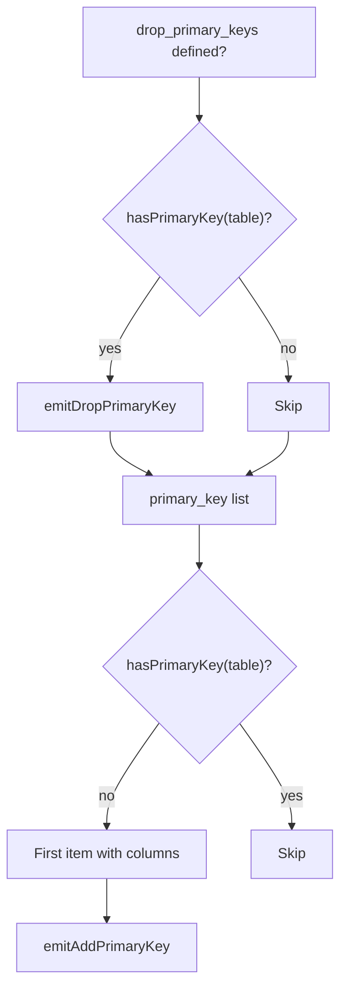

**Checks:** `Schema::getTable()->getPrimaryKey() !== null` (via `hasPrimaryKey()`).  
**API:** `Table::getPrimaryKey()`, `setPrimaryKey()`, `emitAlterTable()`.

---

## 8. Indexes: drop (by name) and add

**What this diagram shows:** For each index entry: if `drop` is set, the index is dropped by name only if it exists. If not dropping, the entry defines columns (and optionally name and unique); if an index with that name already exists, the step is skipped; otherwise the service emits ADD INDEX (or ADD UNIQUE). Index name comes from the definition or is generated (e.g. idx_tablename_cols). This keeps index creation idempotent.

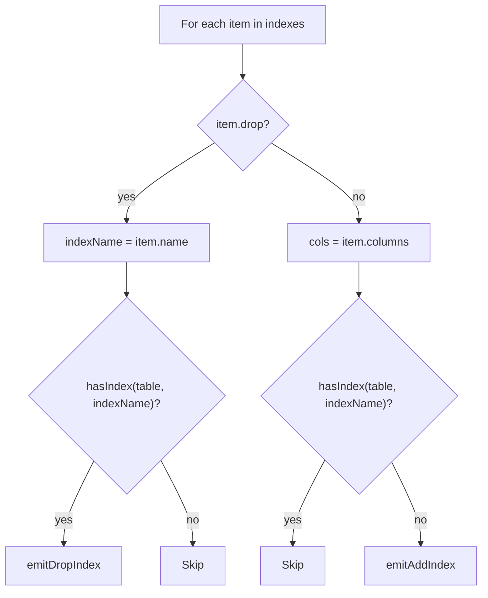

**Checks:** `Schema::getTable()->hasIndex(indexName)`.  
**API:** `Table::getIndexes()`, `addIndex()` / `addUniqueIndex()`, `emitAlterTable()`. Index name from `item.name` or `SchemaNameGenerator::generateIndexName(tableName, columns)`.

---

## 9. Foreign keys: drop (by name) and add

**What this diagram shows:** For each foreign key entry: if `drop` is set, the FK is dropped by name only when it exists. If not dropping, the service adds the FK to the “to” schema (addForeignKeyConstraint) and then runs the comparator to emit ALTER TABLE ADD CONSTRAINT. There is no “FK already exists” check by name in this diagram; the actual implementation skips adding when the FK name is already present. The diagram emphasizes the drop-by-name vs add path.

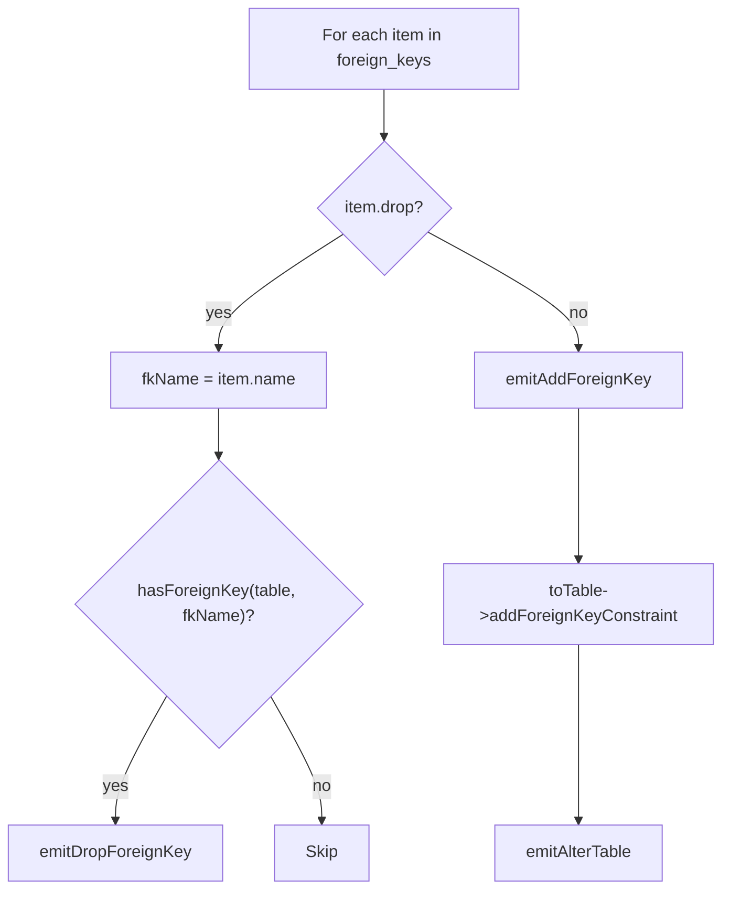

**Checks:** `Schema::getTable()->hasForeignKey(fkName)`.  
**API:** `Table::getForeignKeys()`, `addForeignKeyConstraint()`, `removeForeignKey()`, `emitAlterTable()`. FK name from `item.name` or `SchemaNameGenerator::generateForeignKeyName()`.

---

## 10. emitAlterTable (core of all table changes)

**What this diagram shows:** Every structural change to an existing table (add/drop/rename/modify column, add/drop index, add/drop FK, add/drop PK) is implemented by comparing two schemas: one with the current table state and one with the desired state. The comparator produces a SchemaDiff; the platform turns each TableDiff into ALTER TABLE SQL. All those statements are added to the result. This single path keeps the logic consistent across DBAL versions and platforms.

Every **add column**, **drop column**, **rename column**, **modify column**, **add/drop index**, **add/drop FK**, **add/drop primary key** ends up here:

```mermaid
flowchart TD
    A[emitAlterTable(fromTable, toTable)] --> B[comparator = createComparator]
    B --> C[fromSchema = new Schema; toSchema = new Schema]
    C --> D[schemaAddTable(fromSchema, fromTable)]
    D --> E[schemaAddTable(toSchema, toTable)]
    E --> F[diff = comparator->compareSchemas(fromSchema, toSchema)]
    F --> G[modified = diff->getModifiedTables or getAlteredTables]
    G --> H[For each tableDiff: platform->getAlterTableSQL(tableDiff)]
    H --> I[addSql for each SQL]
```

**API:** `Comparator::compareSchemas(Schema, Schema)`, `SchemaDiff::getModifiedTables()` / `getAlteredTables()`, `AbstractPlatform::getAlterTableSQL(TableDiff)`.

---

## 11. API usage summary

**What this table shows:** For each kind of schema change (drop/create table, add/drop/rename/modify column, add/drop index, add/drop FK, add/drop PK), the table lists the condition used to decide whether to act (e.g. `hasTable`, `hasColumn`) and the main API used to produce SQL (e.g. platform methods, comparator, emitAlterTable). All conditions are evaluated against the Schema instance passed into `apply()`; the service does not introspect the database during `apply()`.

| Scenario | Checks | Methods / API used |
|----------|--------|--------------------|
| **Drop table** | `Schema::hasTable()` | `Schema::getTable()`, `Platform::getDropTableSQL(Table)` |
| **Create table** | `!Schema::hasTable()` | `SchemaDefinitionParser::parseTable()`, `Platform::getCreateTableSQL(Table)` |
| **Drop column** | `Table::hasColumn()` | `Table::getColumns()`, copy table without column, `Comparator::compareSchemas`, `Platform::getAlterTableSQL()` |
| **Rename column** | `Table::hasColumn(old)`, `!hasColumn(new)` | Build new Table with renamed column, `emitAlterTable()` |
| **Add column** | `!Table::hasColumn()` | `Table::addColumn()`, `emitAlterTable()` |
| **Modify column** | `Table::hasColumn()` | `Table::dropColumn()` + `addColumn()` (same name, new options), `emitAlterTable()` |
| **Drop index** | `Table::hasIndex()` | Build Table without that index, `emitAlterTable()` |
| **Add index** | `!Table::hasIndex()` | `Table::addIndex()` / `addUniqueIndex()`, `emitAlterTable()` |
| **Drop FK** | `Table::hasForeignKey()` | `Table::removeForeignKey()`, `emitAlterTable()` |
| **Add FK** | (no check by name; add always) | `Table::addForeignKeyConstraint()`, `emitAlterTable()` |
| **Drop PK** | `Table::getPrimaryKey() !== null` | Build Table without PK, `emitAlterTable()` |
| **Add PK** | `!hasPrimaryKey()` | `Table::setPrimaryKey()`, `emitAlterTable()` |

All **checks** use the **Schema** instance passed into `apply($schema, ...)` (from the migration's `up()`/`down()`). The service does **not** call `SchemaChecker::tableExists()` or introspect the database during `apply()`; it only uses `$schema->hasTable()`, `$schema->getTable()->hasColumn()`, etc.

---

## 12. Case: migration up() — create table + add column on another table

**What this diagram shows:** Example run of `apply()` when one new table (`kit_example`) is created and one existing table (`kit_users`) gets a new column and index. The drop phase is empty so it is skipped. For `kit_example`, the table does not exist, so the create path runs (parseTable, getCreateTableSQL, addSql). For `kit_users`, the table exists, so the edit path runs: no drops, then the new column `kit_extra` is added (comparator yields ALTER TABLE ADD COLUMN), then the new index is added (comparator yields CREATE INDEX). This is the typical first-migration pattern.
Typical “first migration” pattern: one new table, and one existing table that gets a new column and index.

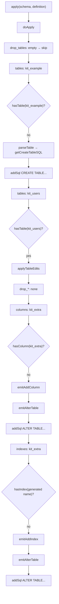

---

## 13. Case: migration down() — drop table + drop column and index

**What this diagram shows:** Reverting the previous example: `drop_tables` includes `kit_example`, so the service emits DROP TABLE for it (if it exists). Then for `kit_users`, the table exists so the edit path runs: drop the index by name (emitDropIndex), then drop the column `kit_extra` (emitDropColumn). The order (index then column) matches the dependency: indexes are dropped before columns. This is the same order as in Phase 1 (indexes) and Phase 2 (columns).

Reverting the above: drop the created table, and on the other table drop the column and index.

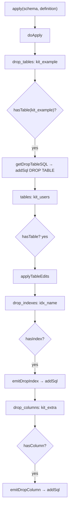

---

## See also

- [DECLARATIVE_SCHEMA.md](DECLARATIVE_SCHEMA.md) — definition keys and structure.
- [EXAMPLE.md](EXAMPLE.md) — migration code examples.
- `CreateTablesService.php` — source of the apply() flow.
